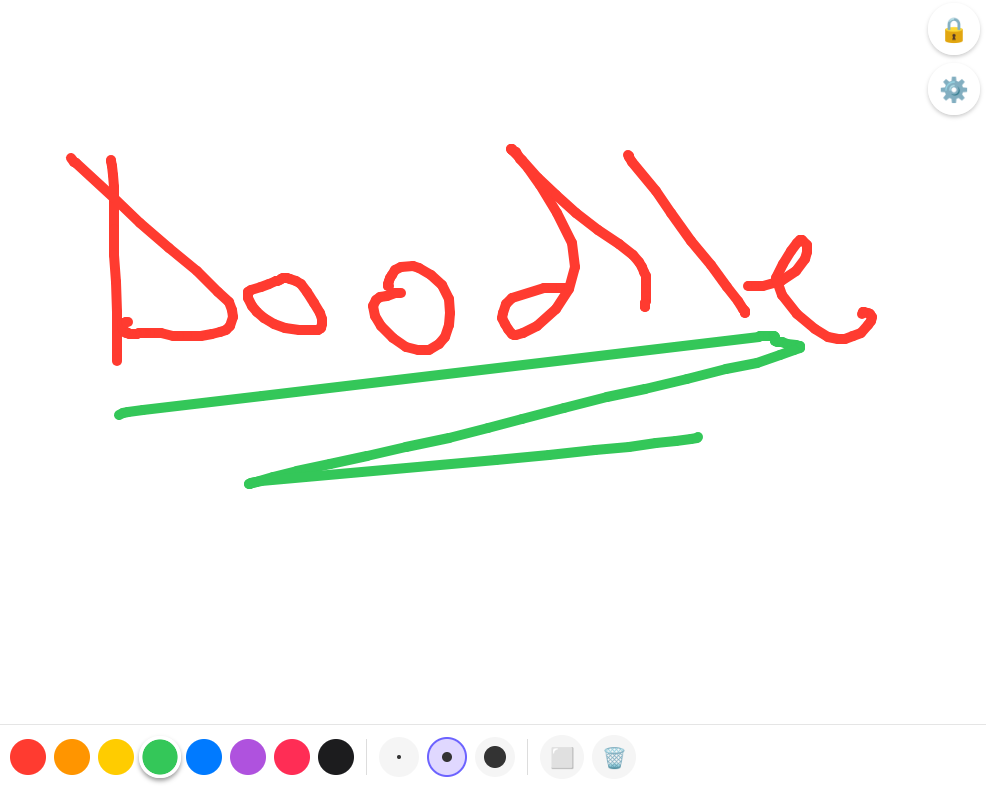

# KidsDoodle



A drawing app for kids with a parent-lock feature. Kids can draw freely; parents can lock the screen behind a PIN so the child can't navigate away.

## Tech Stack

| | |
|---|---|
| Runtime | Expo SDK 55 / React Native 0.83 |
| Language | TypeScript (strict) |
| Navigation | expo-router (file-based) |
| Drawing — Android | react-native-svg 15 (MIT, builds from source — see [docs/PACKAGING.md](docs/PACKAGING.md)) |
| Drawing — Web | HTML5 `<canvas>` (platform file: `DrawingCanvas.web.tsx`) |
| Touch input | react-native-gesture-handler v2 (Gesture API) |
| PIN storage | AsyncStorage + expo-crypto SHA-256 |
| Android nav bar | expo-navigation-bar (hidden in lock mode) |
| Screen wake | expo-keep-awake (screen stays on while drawing) |

## Project Structure

```
app/
  _layout.tsx      Root layout — GestureHandlerRootView, no headers
  index.tsx        Draw screen (home); redirects to /pin-setup on first launch
  pin-setup.tsx    4-digit PIN creation (enter → confirm)
  settings.tsx     Change PIN (requires current PIN)

components/
  DrawingCanvas.tsx      Native: react-native-svg <Path> + RNGH PanGesture
  DrawingCanvas.web.tsx  Web: HTML5 <canvas>
  ColorPicker.tsx        8-swatch color picker
  Toolbar.tsx            Colors + S/M/L brush + eraser + undo + clear
  PinPad.tsx             4-digit numeric pad with shake animation

hooks/
  usePin.ts          Save / verify / clear hashed PIN
  useLockState.ts    locked boolean + lock / unlock

utils/
  hash.ts            expo-crypto SHA-256 wrapper

plugins/
  withReleaseSigning.js          Release keystore instead of the debug key
  withOfflineReleaseManifest.js  Drops INTERNET from release builds

android/                         Committed, not generated at build time
fastlane/metadata/               Store listing, read by fdroid update
fdroid/com.kidsdoodle.app.yml    Licence/categories/links for the repo index
```

## Setup

### Prerequisites

- Node.js 18+
- Expo Go on Android, or a local debug build (`npm run android`)
- For a release build: JDK 17 + the Android SDK, or just push a tag and let CI do it

### Install

```bash
git clone <repo>
cd kids-doodle
npm install
```

### Run on device (Expo Go)

```bash
npx expo start
```

Scan the QR code with Expo Go on Android.

> **Note:** `expo-navigation-bar` (hiding the system nav bar while locked) only works in a native build (`npm run android`). All other features work in Expo Go.

### Run on Android emulator

```bash
npx expo start --android
```

### Run in browser

```bash
npx expo start --web
```

The web version uses an HTML5 canvas rather than react-native-svg. Full feature parity except the nav-bar hiding (web has no system nav bar).

## Distribution

The app is not on Google Play. Each `v*` tag builds three signed APKs, one per
CPU architecture, and attaches them to a GitHub Release; a self-hosted F-Droid
repo at [`lbellows/fdroid`](https://github.com/lbellows/fdroid) — shared with
the sibling BracketUp app — indexes those same files so any F-Droid client can
install and update from it. [Obtainium](https://obtainium.imranr.dev/) works
against the Releases page with no setup on our side. See
**[docs/PACKAGING.md](docs/PACKAGING.md)** for the release process, the keystore
setup, and the repo URL and fingerprint.


The released APK requests no Android permission at all. It has no network
access, no ads, no analytics and no third-party SDKs.

## Building a release APK

The app is not built with EAS or shipped to Google Play, so there is no
`eas.json`. Release APKs are built from the committed `android/` project:

```bash
cd android && ./gradlew assembleRelease      # debug-signed, like F-Droid's build
```

Pushing a `v*` tag builds and signs one in CI and attaches it to a GitHub
Release. See [docs/PACKAGING.md](docs/PACKAGING.md).

## Features

| Feature | Android | Web |
|---|---|---|
| Freehand drawing | SVG paths | HTML5 canvas |
| 8 preset colors | ✓ | ✓ |
| Brush sizes (S / M / L) | ✓ | ✓ |
| Eraser | ✓ | ✓ |
| Undo last stroke | ✓ | ✓ |
| Clear canvas | ✓ | ✓ |
| Keep screen awake | ✓ | n/a |
| Lock screen (PIN overlay) | ✓ | ✓ |
| Wrong-PIN shake + vibrate | ✓ | shake only |
| Hide system nav bar | ✓ | n/a |
| Block hardware back button | ✓ | n/a |
| First-launch PIN setup | ✓ | ✓ |
| Change PIN (settings) | ✓ | ✓ |

## First Launch Flow

1. App opens → no PIN found in AsyncStorage → redirect to **PIN Setup**
2. Enter a 4-digit PIN, then confirm it
3. PIN is SHA-256 hashed and saved to AsyncStorage
4. Returned to the draw screen

## Lock Flow

1. Tap 🔒 (top-right) → semi-transparent overlay covers the canvas
2. Android: system nav bar hides, hardware back button is blocked
3. Enter the correct 4-digit PIN → overlay dismisses
4. Wrong PIN → shake animation + vibration, try again

## Known Issues / Notes

- **Expo Go + nav bar**: `expo-navigation-bar` is a native module; the lock-screen nav-bar-hiding feature requires a native build via EAS (`preview` or `development` profile).
- **No Skia**: the native canvas uses `react-native-svg`, not `@shopify/react-native-skia`. Skia downloads prebuilt static libraries from GitHub Releases at install time, which breaks this repo's no-prebuilt-binaries rule. Don't reintroduce it. See [docs/PACKAGING.md](docs/PACKAGING.md).
- **Metro platform resolution**: `metro.config.js` explicitly adds `'web'` to `resolver.platforms`; without this, Metro ignores `.web.tsx` files even when bundling for web.
- **`android/` is committed**: regenerate it with `npx expo prebuild --platform android` after changing `app.json` or `plugins/`, and commit the diff. CI fails if it is out of sync.
